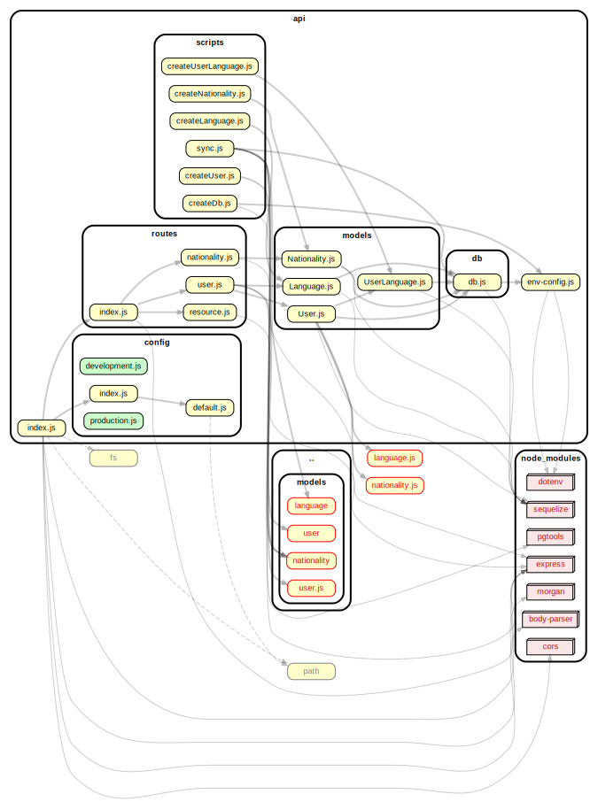

<!-- BEGIN title -->

# API

<!-- END title -->

<!-- BEGIN TREE -->

<!-- END TREE -->

<!-- BEGIN TOC -->

- business-logic
- config
  - [default.js](#apiconfigdefaultjs)
  - [development.js](#apiconfigdevelopmentjs)
  - [index.js](#apiconfigindexjs)
  - [production.js](#apiconfigproductionjs)
- controllers
- data-access
- db
  - [db.js](#apidbdbjs)
- middleware
- models
  - [Language.js](#apimodelsLanguagejs)
  - [Nationality.js](#apimodelsNationalityjs)
  - [User.js](#apimodelsUserjs)
  - [UserLanguage.js](#apimodelsUserLanguagejs)
- routes
  - [index.js](#apiroutesindexjs)
  - [nationality.js](#apiroutesnationalityjs)
  - [resource.js](#apiroutesresourcejs)
  - [user.js](#apiroutesuserjs)
- scripts
  - [createDb.js](#apiscriptscreateDbjs)
  - [createLanguage.js](#apiscriptscreateLanguagejs)
  - [createNationality.js](#apiscriptscreateNationalityjs)
  - [createUser.js](#apiscriptscreateUserjs)
  - [createUserLanguage.js](#apiscriptscreateUserLanguagejs)
  - [sync.js](#apiscriptssyncjs)
- utils
- [config.js](#apiconfigjs)
- [index.js](#apiindexjs)

---

<!-- END TOC -->

---

<!-- BEGIN DOCS -->

# /business-logic

---

# /config

<a href="../../api/config/default.js" id="apiconfigdefaultjs">../api/config/default.js</a>

<a href="../../api/config/development.js" id="apiconfigdevelopmentjs">../api/config/development.js</a>

<a href="../../api/config/index.js" id="apiconfigindexjs">../api/config/index.js</a>

<a href="../../api/config/production.js" id="apiconfigproductionjs">../api/config/production.js</a>

---

# /controllers

---

# /data-access

---

# /db

<a href="../../api/db/db.js" id="apidbdbjs">../api/db/db.js</a>

---

# /middleware

---

# /models

<a href="../../api/models/Language.js" id="apimodelsLanguagejs">../api/models/Language.js</a>

<a href="../../api/models/Nationality.js" id="apimodelsNationalityjs">../api/models/Nationality.js</a>

<a href="../../api/models/User.js" id="apimodelsUserjs">../api/models/User.js</a>

<a href="../../api/models/UserLanguage.js" id="apimodelsUserLanguagejs">../api/models/UserLanguage.js</a>

---

# /routes

<a href="../../api/routes/index.js" id="apiroutesindexjs">../api/routes/index.js</a>

<a href="../../api/routes/nationality.js" id="apiroutesnationalityjs">../api/routes/nationality.js</a>

<a href="../../api/routes/resource.js" id="apiroutesresourcejs">../api/routes/resource.js</a>

<a href="../../api/routes/user.js" id="apiroutesuserjs">../api/routes/user.js</a>

---

# /scripts

<a href="../../api/scripts/createDb.js" id="apiscriptscreateDbjs">../api/scripts/createDb.js</a>

<a href="../../api/scripts/createLanguage.js" id="apiscriptscreateLanguagejs">../api/scripts/createLanguage.js</a>

<a href="../../api/scripts/createNationality.js" id="apiscriptscreateNationalityjs">../api/scripts/createNationality.js</a>

<a href="../../api/scripts/createUser.js" id="apiscriptscreateUserjs">../api/scripts/createUser.js</a>

<a href="../../api/scripts/createUserLanguage.js" id="apiscriptscreateUserLanguagejs">../api/scripts/createUserLanguage.js</a>

<a href="../../api/scripts/sync.js" id="apiscriptssyncjs">../api/scripts/sync.js</a>

---

# /utils

---

<a href="../../api/config.js" id="apiconfigjs">../api/config.js</a>

<a href="../../api/index.js" id="apiindexjs">../api/index.js</a>

<!-- END DOCS -->
