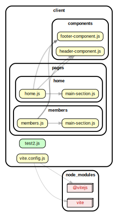

<!-- BEGIN title -->

# CLIENT

<!-- END title -->

<!-- BEGIN TREE -->

<!-- END TREE -->

<!-- BEGIN TOC -->

- assets
- components
  - [footer-component.js](#clientcomponentsfooter-componentjs)
  - [header-component.js](#clientcomponentsheader-componentjs)
- pages
  - home
    - [home.js](#clientpageshomehomejs)
    - [main-section.js](#clientpageshomemain-sectionjs)
  - members
    - [main-section.js](#clientpagesmembersmain-sectionjs)
    - [members.js](#clientpagesmembersmembersjs)
- [test2.js](#clienttest2js)
- [vite.config.js](#clientviteconfigjs)

---

<!-- END TOC -->

---

<!-- BEGIN DOCS -->

# /assets

---

# /components

<a href="../../client/components/footer-component.js" id="clientcomponentsfooter-componentjs">../client/components/footer-component.js</a>

<a href="../../client/components/header-component.js" id="clientcomponentsheader-componentjs">../client/components/header-component.js</a>

---

# /pages

## /home

<a href="../../client/pages/home/home.js" id="clientpageshomehomejs">../client/pages/home/home.js</a>

<a href="../../client/pages/home/main-section.js" id="clientpageshomemain-sectionjs">../client/pages/home/main-section.js</a>

---

## /members

<a href="../../client/pages/members/main-section.js" id="clientpagesmembersmain-sectionjs">../client/pages/members/main-section.js</a>

<a href="../../client/pages/members/members.js" id="clientpagesmembersmembersjs">../client/pages/members/members.js</a>

---

---

<a href="../../client/test2.js" id="clienttest2js">../client/test2.js</a>

<a href="../../client/vite.config.js" id="clientviteconfigjs">../client/vite.config.js</a>

<!-- END DOCS -->
